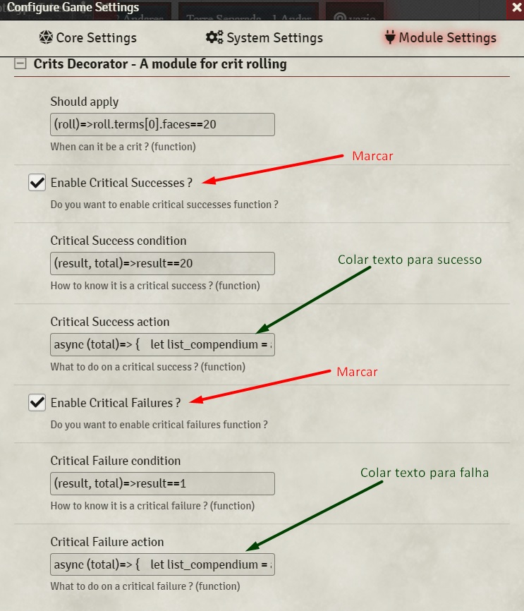

# APP das Cartas Críticas para D&D 5e
Está jogando D&D e tirou um 20 no ataque e não sabe o que fazer além de aplicar o dano crítico?

Ou acabou tirando “1” num ataque e não sabe o que fazer além de dizer que foi um erro?

Seus problemas se acabaram!!! (ou começaram, uma vez que usar essas cartas pode ser mortal!)

Chegou o APP das CARTAS CRÍTICAS para D&D 5e! Sua versão contém 52 Cartas de Acerto Crítico e 52 Cartas de Falha Crítica !

Mais emoção nos Acertos Críticos e Falhas Críticas na sua mesa de RPG com D&D 5e. Utilize toda vez que um acerto crítico ou falha crítica sair em um ataque. Basta clicar no botão da carta correspondente e aplicar o resultado!

<p align="center">
  
</p>

<p align="center">
  
</p>

# Instalação

## Instalação pelo Foundry VTT
1. Vá na interface de adminstração do Foundry VTT
2. Vá na guia Módulos. Procure por RPG Next. Instale.

## Instalação Manual
1. Vá em **Módulos** e use o link abaixo: 
Use this: https://raw.githubusercontent.com/brunocalado/10plus-v2-moremagicitems/main/module.json

# Como Usar

## Métodos Rudimentares
- Abra o compêndio com a tabela e role.
- Você pode criar um atalho para cada tabela na barra de atalhos.

## Método - Botão de Rolagem
1. Instale e ative o módulo [Rolltable Buttons](https://github.com/RaySSharma/fvtt-rolltable-buttons)
2. Importe o compêndio com as tabelas.
3. Atalho rápido no chat.

## Método - Automático
1. Instale e ative o módulo [Crits Decorator](https://gitlab.com/Nat-Faeeria/crit-decorator)
2. Vá em configurações do módulo
3. Marque as caixas conforme a imagem.
4. Cole o texto de acerto no local indicado.
5. Cole o texto de falha no local indicado.
<p align="center">
  
</p>

### Texto para o Acerto Crítico
```js
async (total)=> { 
  let list_compendium = await game.packs.filter(p=>p.entity=='RollTable');
  let table = await list_compendium.filter( p=>p.metadata.label=='RPG Next - Tabelas' )[0].getContent();
  table[0].draw();   
  let chatData = { user: game.user.id, content: `<h1>Sucesso Crítico!!!</h1>`, speaker: ChatMessage.getSpeaker()};
  ChatMessage.create(chatData, {});
}
```

### Texto para a Falha Crítica
```js
async (total)=> { 
  let list_compendium = await game.packs.filter(p=>p.entity=='RollTable');
  let table = await list_compendium.filter( p=>p.metadata.label=='RPG Next - Tabelas' )[0].getContent();
  table[1].draw();   
  let chatData = { user: game.user.id, content: `<h1>Falha Crítica!!!</h1>`, speaker: ChatMessage.getSpeaker()};
  ChatMessage.create(chatData, {});
}
```

# Mudanças
Podem ver alterações nas versões em [CHANGELOG](CHANGELOG.md)

# License
These items are from the **RPG Next**. They were publish with consent from **Rafael Quarenta E Sete** (https://www.facebook.com/rbl047).

You can also get them from: https://www.rpgnext.com.br/aplicativo/app-das-cartas-criticas-para-dnd-5e/