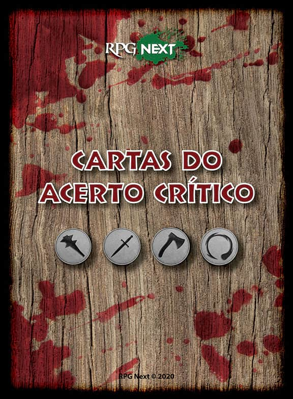
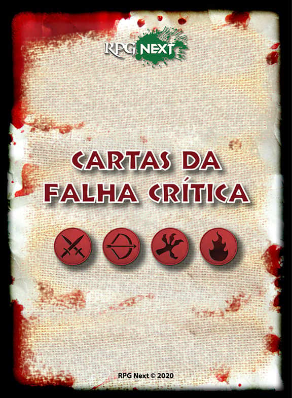

# APP das Cartas Críticas para D&D 5e
Está jogando D&D e tirou um 20 no ataque e não sabe o que fazer além de aplicar o dano crítico?

Ou acabou tirando “1” num ataque e não sabe o que fazer além de dizer que foi um erro?

Seus problemas se acabaram!!! (ou começaram, uma vez que usar essas cartas pode ser mortal!)

Chegou o APP das CARTAS CRÍTICAS para D&D 5e! Sua versão contém 52 Cartas de Acerto Crítico e 52 Cartas de Falha Crítica !

Mais emoção nos Acertos Críticos e Falhas Críticas na sua mesa de RPG com D&D 5e. Utilize toda vez que um acerto crítico ou falha crítica sair em um ataque. Basta clicar no botão da carta correspondente e aplicar o resultado!

<table>
<thead>
  <tr>
    <th>

  

</th>
    <th>

  

</th>
  </tr>
</thead>
</table>

# Instalação

## Instalação pelo Foundry VTT
1. Vá na interface de adminstração do Foundry VTT
2. Vá na guia Módulos. Procure por RPG Next. Instale.

## Instalação Manual
1. Vá em **Módulos** e use o link abaixo: 
Use this: https://raw.githubusercontent.com/brunocalado/rpgnextcriticos/main/module.json

# Como Usar

Leia a documentação que está nos registros em compêndio dentro do módulo.

# Mudanças
Podem ver alterações nas versões em [CHANGELOG](CHANGELOG.md)

# License
These items are from the **RPG Next**. They were publish with consent from **Rafael Quarenta E Sete** (https://www.facebook.com/rbl047).

You can also get them from: https://www.rpgnext.com.br/aplicativo/app-das-cartas-criticas-para-dnd-5e/

# Mestre Digital
About this module creator: https://sites.google.com/view/mestredigitalmodules