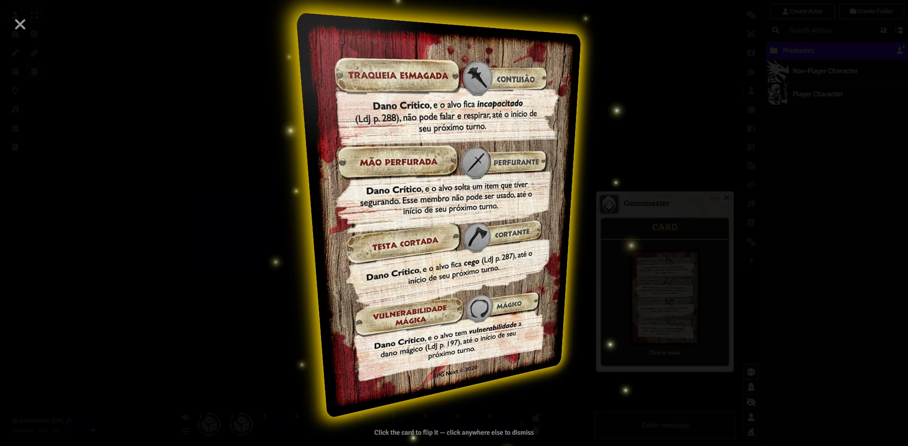
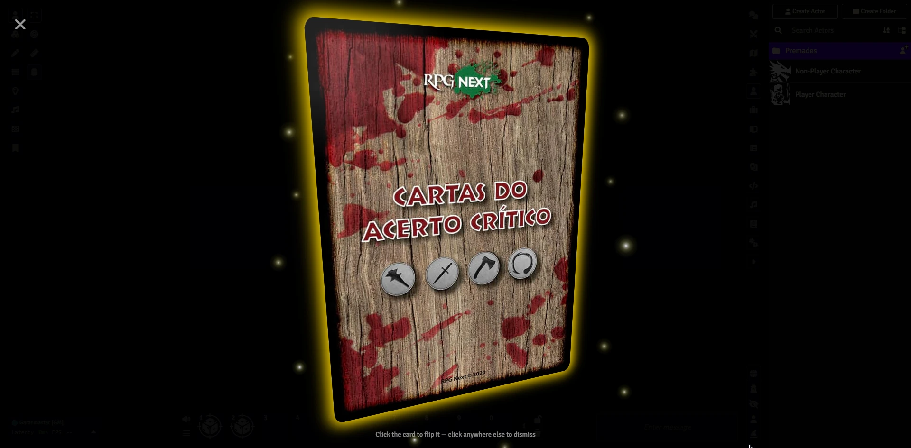

# Cartas Críticas do RPG Next para D&D 5e

Está jogando D&D e tirou um 20 no ataque e não sabe o que fazer além de aplicar o dano crítico?

Ou acabou tirando “1” num ataque e não sabe o que fazer além de dizer que foi um erro?

Seus problemas se acabaram!!! (ou começaram, uma vez que usar essas cartas pode ser mortal!)

Chegou o APP das CARTAS CRÍTICAS para D&D 5e! Sua versão contém 52 Cartas de Acerto Crítico e 52 Cartas de Falha Crítica !

Mais emoção nos Acertos Críticos e Falhas Críticas na sua mesa de RPG com D&D 5e. Utilize toda vez que um acerto crítico ou falha crítica sair em um ataque. Basta clicar no botão da carta correspondente e aplicar o resultado!




[](https://buymeacoffee.com/mestredigital)

# Como Usar

> **Pré-requisito:** o módulo [Epic 3D Card Reveal](https://github.com/brunocalado/epic-3d-card-reveal) precisa estar **instalado e ativo** — é ele quem exibe a carta em 3D e posta a mensagem no chat.

A ativação é feita por uma **API global**, que pode ser chamada de qualquer macro, módulo ou do sistema:

```js
RPGNext.Critical("sucesso"); // sorteia e revela uma carta de Acerto Crítico
RPGNext.Critical("falha");   // sorteia e revela uma carta de Falha Crítica
```

Também aceita os apelidos `"acerto"` e `"erro"`, e não diferencia maiúsculas/minúsculas. A carta é sorteada aleatoriamente (pode repetir) e exibida para todos os jogadores pelo Epic 3D Card Reveal, que também cuida da mensagem de chat. A aparência (brilho, som, estilo do reveal) é configurada nas opções do próprio Epic 3D Card Reveal.

## Botão Flutuante

A forma mais fácil de usar o módulo agora é através do **botão flutuante** que aparece na tela dos jogadores. 

- Toda vez que sair um acerto crítico ou uma falha crítica, basta o jogador clicar no botão correspondente na tela. A carta será sorteada e a animação 3D aparecerá na tela de todos automaticamente!
- O painel é arrastável: os jogadores podem movê-lo para onde acharem melhor na tela.
- **Mestres:** O botão não aparece para o mestre. Se quiser desativar o botão flutuante para os jogadores, basta ir nas **Configurações de Módulos (Settings -> Configure Settings)** do próprio Foundry, buscar pelo "Cartas Críticas do RPG Next para D&D 5e" e desmarcar a exibição do botão.

## Macros prontas

O módulo já traz as macros no compêndio **RPG Next - Macros**:

1. Abra a aba **Compêndios** (ícone de livro na barra lateral).
2. Abra **RPG Next - Macros** e arraste as macros desejadas para a sua **barra de atalhos (hotbar)**.
3. Clique na macro toda vez que sair um acerto crítico ou uma falha crítica.

### Criar a sua própria macro

Se preferir criar a sua:

1. Clique com o botão direito em um espaço vazio da **hotbar** → **Create Macro** (ou clique no `+`).
2. Em **Type**, escolha **Script**.
3. Cole **uma** das linhas abaixo no corpo da macro:

   - Acerto crítico:
     ```js
     RPGNext.Critical("sucesso");
     ```
   - Falha crítica:
     ```js
     RPGNext.Critical("falha");
     ```

4. Dê um nome, salve e clique na macro para usar.

> Dica: por ser uma API global, você também pode chamar `RPGNext.Critical("sucesso")` a partir de outros módulos, de gatilhos automáticos (ex.: ao detectar um 20 natural) ou direto no console (F12).

Leia também a documentação que está nos registros em compêndio dentro do módulo.

# Instalação

## Instalação pelo Foundry VTT

1. Vá na interface de adminstração do Foundry VTT
2. Vá na guia Módulos. Procure por RPG Next. Instale.

## Instalação Manual

1. Vá em **Módulos** e use o link abaixo: 
Use this: 

```
https://raw.githubusercontent.com/brunocalado/rpgnextcriticos/main/module.json
```

# Mudanças

Podem ver alterações nas versões em [CHANGELOG](CHANGELOG.md)

# Credits and License

- Released under the [LICENSE](LICENSE).

These items are from the **RPG Next**. They were publish with consent from **Rafael Quarenta E Sete** (https://www.facebook.com/rbl047).

You can also get them from: https://www.rpgnext.com.br/aplicativo/app-das-cartas-criticas-para-dnd-5e/
